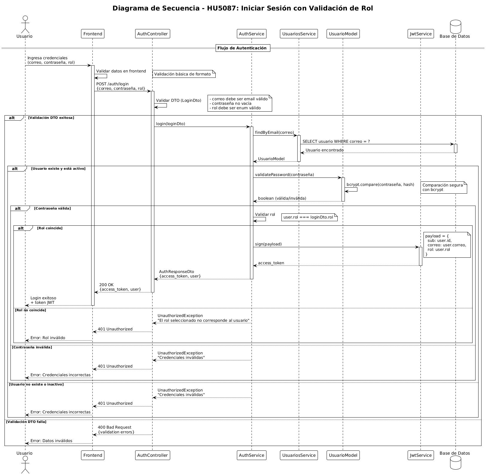

# Sprint 6.1 - Gestión de Usuarios y Autenticación

[← Volver al inicio](../)

Este sprint implementa las funcionalidades principales del sistema PoliAcreditaIA relacionadas con la gestión de usuarios, autenticación, y administración académica.

## 🔐 Autenticación y Sesiones

### [HU5087 - Iniciar Sesión](HU5087/HU5087.md)
**Descripción**: Sistema de autenticación con credenciales y validación de roles.

**Componentes**:
- Validación de credenciales (email/contraseña)
- Generación de tokens JWT
- Hashing seguro de contraseñas
- Validación de roles

---

### [HU5089 - Cerrar Sesión](HU5089.md)
**Descripción**: Funcionalidad para cerrar sesión de manera segura.

---

### [HU5115 - Cambio de Contraseña Personal](HU5115/HU5115.md)
**Descripción**: Permitir a los usuarios cambiar su contraseña de forma segura.

---

## 👥 Gestión de Usuarios

### [HU5090 - Listar Usuarios](HU5090/HU5090.md)
**Descripción**: Vista administrativa para listar todos los usuarios del sistema.

**Funcionalidades**:
- Lista completa de usuarios registrados
- Información de roles y estados
- Acceso restringido a administradores

---

### [HU5092 - Filtrar Usuarios por Rol](HU5092/HU5092.md)
**Descripción**: Sistema de filtrado para visualizar usuarios según su rol.

---

### [HU5095 - Cambiar Estado de Usuario](HU5095/HU5095.md)
**Descripción**: Funcionalidad administrativa para activar/desactivar usuarios.

---

### [HU5099-5107 - Búsqueda Paginada de Usuarios](HU5099-5107/HU5099.md)
**Descripción**: Sistema avanzado de búsqueda con paginación para encontrar usuarios.

---

### [HU5102 - Crear Nuevo Usuario](HU5102/HU5102.md)
**Descripción**: Funcionalidad para registrar nuevos usuarios en el sistema.

---

### [HU5116 - Visualizar Perfil Personal](HU5116/HU5116.md)
**Descripción**: Vista del perfil personal del usuario autenticado.

---

## 🏛️ Gestión Académica

### [HU5094-5098 - Gestión de Facultades](HU5094-5098/HU5094.md)
**Descripción**: Sistema completo para la gestión de facultades universitarias.

**Incluye**:
- Listado de facultades con filtros
- Búsqueda avanzada
- Gestión administrativa

---

### [HU5100 - Crear Nueva Facultad](HU5100.md)
**Descripción**: Funcionalidad para registrar nuevas facultades en el sistema.

---

### [HU5104-5110 - Gestión de Carreras](HU5104-5110/HU5104.md)
**Descripción**: Sistema completo para la administración de carreras universitarias.

---

### [HU5108 - Crear Nueva Carrera](HU5108/HU5108.md)
**Descripción**: Funcionalidad para registrar nuevas carreras académicas.

---

## 📊 Dashboard y Monitoreo

### [HU5091 - Dashboard de Actividad](HU5091/HU5091.md)
**Descripción**: Panel de control con métricas y actividad del sistema.

---

## ⚙️ Funcionalidades Adicionales

### [HU5093 - Actualizar Información Personal](HU5093.md)
**Descripción**: Permitir a los usuarios actualizar su información personal.

---

### [HU5113 - Gestión Avanzada de Usuarios](HU5113.md)
**Descripción**: Funcionalidades administrativas avanzadas para la gestión de usuarios.

---

### [HU5114 - Notificaciones del Sistema](HU5114.md)
**Descripción**: Sistema de notificaciones para eventos importantes del sistema.

---

### [HU6005 - Funcionalidades Adicionales](HU6005.md)
**Descripción**: Características adicionales y mejoras del sistema.

---

## 📈 Resumen del Sprint

- **Total de Historias**: 18 HUs
- **Estado**: ✅ Completado
- **Funcionalidades principales**:
  - Autenticación y autorización completa
  - Gestión integral de usuarios
  - Administración académica (facultades y carreras)
  - Dashboard administrativo
  - Búsqueda y filtrado avanzado

---

[← Volver al inicio](../)